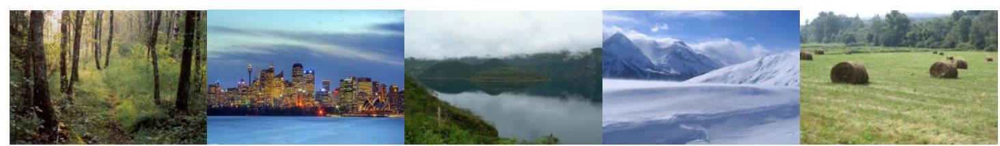

# Projet Deep Learning - Big Data MAPI3 2025

**Auteur :** Jianyu MA  
**Email :** [jianyu.ma@math.univ-toulouse.fr](mailto:jianyu.ma@math.univ-toulouse.fr)  
**Date :** 01 Janvier 2026

---

Ce projet constitue la deuxième partie du projet BigData.

Pour l'évaluation, vous devrez rendre un notebook python détaillé avec des commentaires justifiant les méthodes utilisées.

Vous devrez aussi présenter vos résultats et les méthodes en 15 minutes (+ 10 minutes de questions) lors de la **soutenance du 20/02/2026**.

La performance de vos modèles ne sera pas utilisée comme critère d'évaluation. Nous nous intéresserons uniquement à la méthodologie utilisée, aux comparaisons et analyses produites, ainsi qu'à la variété d'expériences menées. Vous pouvez faire la présentation et le notebook en anglais si vous préférez.

Vous êtes encouragés à:
- utiliser les notebooks de TP comme base de travail.
- utiliser Google Colab pour l'entrainement de vos modèles.
- utiliser la bibliothèque `keras` pour l'entrainement (`tensorflow` et `pytorch` sont acceptés).

Vous devez rendre votre notebook avant le **19/02/2026 à 23h59**.
Vous devez nous le transmettre par mail à :
- [jianyu.ma@math.univ-toulouse.fr](mailto:jianyu.ma@math.univ-toulouse.fr)
- [francois.malgouyres@math.univ-toulouse.fr](mailto:francois.malgouyres@math.univ-toulouse.fr)
- [franck.iutzeler@math.univ-toulouse.fr](mailto:franck.iutzeler@math.univ-toulouse.fr)

en précisant dans l'objet du mail "Projet Deep Learning - Big Data MAPI3 2025".

## Sujet

Vous allez, dans ce projet, entraîner plusieurs réseaux de neurones à classifier des paysages. Vous utiliserez pour cela le dataset Landscapes disponible [ici](https://github.com/ml5js/ml5-data-and-models/tree/master/datasets/images/landscapes).

Il s'agit d'un dataset comprenant 4000 images appartenant à 7 catégories.

*Exemples du dataset*

### Objectifs

Vous devez :

1.  **Séparer vos données** en 2 : un jeu d'apprentissage (80%) et un jeu de validation (20%).
2.  **Entraîner un réseau de convolutions** que vous aurez défini vous-même.
3.  Utiliser de manière individuelle différentes **techniques d'amélioration** de la généralisation (data augmentation, dropout, etc.) pour améliorer votre modèle.
4.  Utiliser un **réseau pré-entraîné** pour améliorer vos performances (transfer learning).
5.  **Comparer les résultats** produits par les étapes 2, 3 et 4 dans un tableau récapitulatif (en utilisant le jeu de validation).
6.  Afficher quelques **exemples d'erreurs** de votre meilleur réseau et ses prédictions pour ces images.
7.  **Visualiser les projections** dans l'espace des features à l'aide d'une t-SNE sur un sous-ensemble du dataset (quelques centaines d'images).
8.  À l'aide des features calculées par votre réseau, choisir une image au hasard dans le dataset et **afficher les 3 images les plus proches** au sens de la distance euclidienne. Vous pourrez, si vous le souhaitez, utiliser les plus proches voisins de Scikit-Learn (`sklearn.neighbors.NearestNeighbors`).
